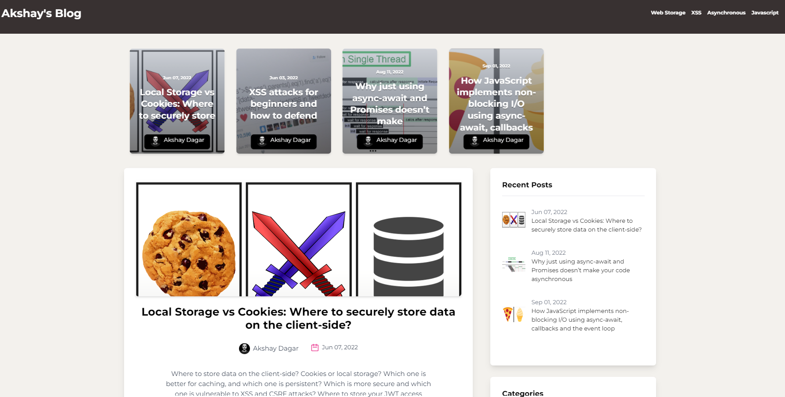

# Akshay's blog
##### https://akshaydagar.vercel.app

##### This is my personal blog application.
##### This application was made using React, Next.js, tailwind-css, graphql, and hygraph cms as the backend. It is deployed using vercel.
##### To run this locally: 
1. Clone the repo, 
2. Create a .env file like in the .env.example
3. Go to the project on hygraph -> project settings -> Access -> Api Access and copy the endpoint and dev token (or create new ones) and paste them in the .env file, just like in .env.example.
4. npm run dev to run a local dev server.
5. Reference: https://www.youtube.com/watch?v=HYv55DhgTuA

Also check out my blog on medium: https://akshaydagar.medium.com
